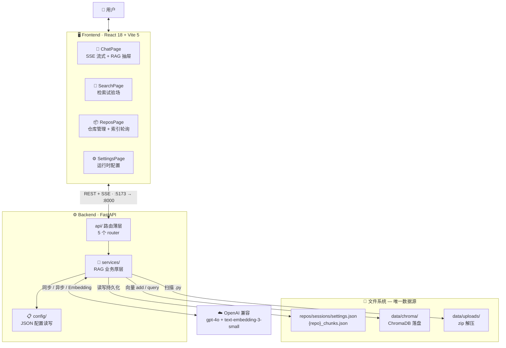
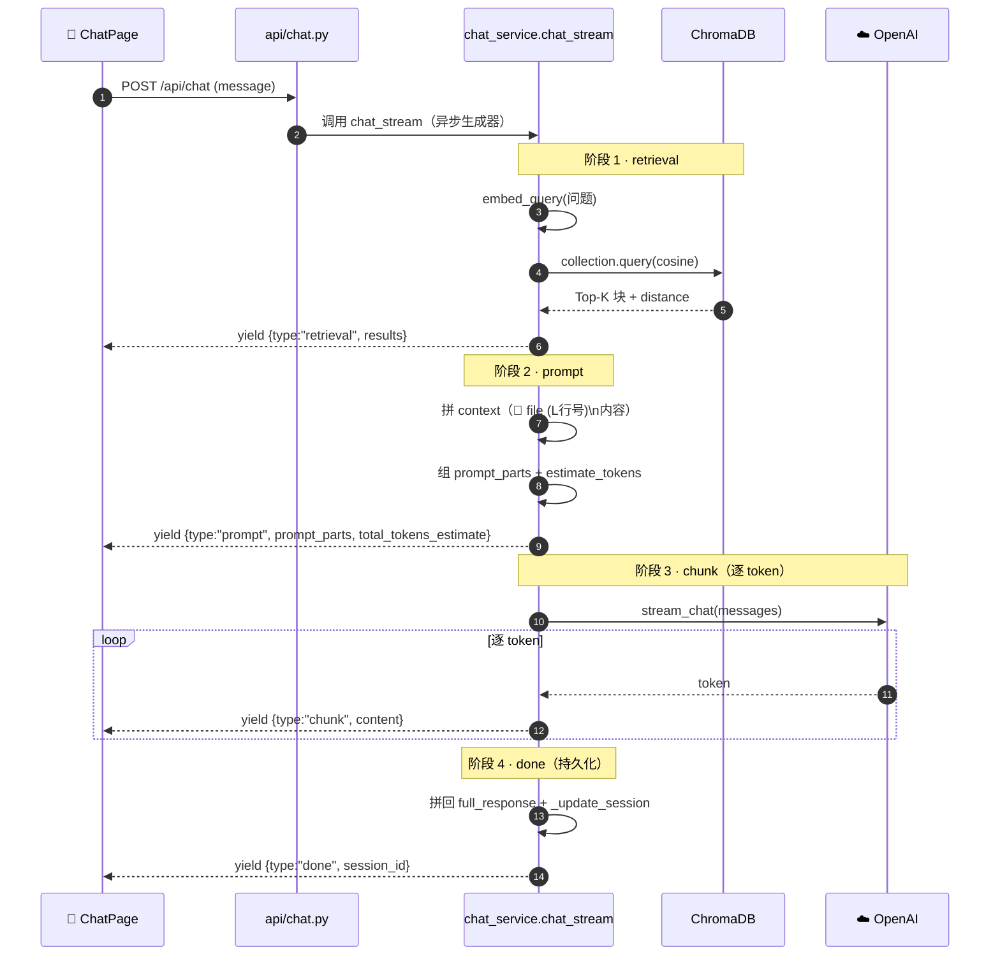

<div align="center">

# 🔍 Code-Probe

**把 Python 代码库变成可对话知识库的全栈 RAG 系统**

*Retrieval-Augmented Generation for Codebases · RAG 全流程可见*

[](https://www.python.org/)
[](https://fastapi.tiangolo.com/)
[](https://react.dev/)
[](https://www.typescriptlang.org/)
[](https://docs.trychroma.com/)
[](https://tailwindcss.com/)
[](./LICENSE)

[快速开始](#-快速开始) · [架构总览](#-架构总览) · [核心亮点](#-核心亮点) · [项目结构](#-项目结构)

</div>

---

> ### 💭 它不做 ChatGPT 套壳，只做代码库的"开卷考试"
> 把一个 Python 代码库丢给它，它切块、向量化、存进 ChromaDB；你用自然语言提问，它检索相关代码片段喂给 LLM，**回答带文件路径和行号**。
> 检索、拼词、生成、持久化四个阶段用 SSE 全程推送，前端实时看见"检索到什么、Prompt 长啥样、Token 估了多少"——**RAG 不是黑盒**。

---

## ✨ 核心亮点

| 🎯 字符分块 · 行边界对齐 | 🔊 SSE 四阶段流式 | 🧩 零数据库工程约束 |
| :---: | :---: | :---: |
| 按 `chunk_size` 字符切，`end_char` 向后扩到下一个 `\n` 对齐行边界，记录 `line_start`/`line_end`，回答可定位回源码行号（`index_service.py · chunk_text`） | `chat_stream` 异步生成器按序 yield `retrieval → prompt → chunk → done`，前端实时看见检索结果、Prompt 组成与 Token 估算（`chat_service.py · chat_stream`） | 持久化全用 JSON 文件 + ChromaDB `PersistentClient` 落盘，零独立数据库依赖，复制即跑（`config/manager.py` + `data/`） |

## 🚀 功能全景

- 📦 **仓库管理** — zip 上传 / 本地路径注册，`BackgroundTasks` 后台索引 + 状态轮询（`api/repos.py`）
- 🧠 **索引核心** — 字符分块 + 行边界对齐 + overlap 防语义断裂，ChromaDB cosine 入库（`services/index_service.py`）
- 🔎 **语义搜索** — 问题向量化 + cosine Top-K 检索 + 相似度分数条（`services/search_service.py`）
- 💬 **流式对话** — SSE 四阶段：retrieval → prompt → chunk → done，打字机效果（`services/chat_service.py`）
- 👁️ **RAG 可视化** — 检索结果 / Prompt 四大组成 / Token 估算抽屉，历史消息回放当时 RAG 过程（`pages/ChatPage.tsx`）
- ⚙️ **运行时配置** — LLM / Embedding / 分块参数热改，API Key 脱敏读写（`api/settings.py`）
- 🌗 **深色优先主题** — Tailwind v4 class 式暗色 + emerald accent，localStorage 持久化（`hooks/useTheme.ts`）

## 🏗️ 架构总览



## 🛠️ 技术栈

| 层 | 技术 |
| --- | --- |
| 后端框架 | Python 3.11 · FastAPI 0.128 · Uvicorn 0.40 · Pydantic 2.12 |
| 向量存储 | ChromaDB 1.5（cosine 距离 · `PersistentClient`） |
| LLM | OpenAI 兼容（`gpt-4o` + `text-embedding-3-small`） |
| 前端框架 | React 18 · Vite 5 · TypeScript 5.6 |
| UI | Radix UI · Phosphor Icons · Motion · react-syntax-highlighter · Tailwind v4 |
| 状态路由 | Zustand 5 · React Router 6 |
| 持久化 | JSON 文件（无独立数据库） |
| 测试 | Pytest 8 · pytest-asyncio |

## 📂 项目结构

```
Code-Probe/
├── backend/                       # ⚙️ 后端：FastAPI + ChromaDB + OpenAI
│   └── app/
│       ├── main.py                #    🔓 FastAPI 入口（CORS + 5 路由挂载）
│       ├── config/                #    📋 配置默认值 + JSON 持久化读写
│       ├── api/                   #    🌐 HTTP 路由薄层（repos/chunks/search/chat/settings）
│       └── services/              #    🔧 RAG 业务厚层（索引/检索/问答/LLM 客户端）
├── frontend/                      # 🖥️ 前端：React 18 + Vite 5 + TS + Tailwind v4
│   └── src/
│       ├── pages/                 #    📄 6 个页面（概览/仓库/详情/聊天/搜索/设置）
│       ├── components/            #    🧩 Layout + 业务组件 + shadcn 风格 UI
│       ├── lib/api.ts             #    🔑 19 endpoint 封装 + SSE 流式解析
│       └── hooks/                 #    🪝 Toast / 主题切换
├── data/                          # 📁 运行时数据（JSON + ChromaDB 落盘）
├── requirements.txt               # 🔑 后端依赖（复制即用）
├── .env.example                   # 🔑 环境变量模板
├── ZHIDAO.md                      # 📖 项目导读指南（逐文件深度导读）
└── Description.md                 # 📝 中英双版项目名片
```

> 逐文件深度导读、运行流程全景图、关键设计模式解析见 [ZHIDAO.md](./ZHIDAO.md)。

<details>
<summary><b>📁 完整目录结构</b>（点击展开）</summary>

```
backend/
├── app/
│   ├── main.py                    # FastAPI 入口（21 行，CORS + 5 路由）
│   ├── config/
│   │   ├── defaults.py            # DEFAULT_SETTINGS 10 项 + 路径常量
│   │   └── manager.py             # JSON 读写 + 默认值合并（向后兼容）
│   ├── api/                       # 路由薄层（参数校验 + 转调 service）
│   │   ├── repos.py               # 仓库 CRUD + 索引触发（BackgroundTasks）
│   │   ├── chunks.py              # 分块查看 + 上下文 + 统计
│   │   ├── search.py              # 语义搜索
│   │   ├── chat.py                # 聊天 SSE + 会话 CRUD + prompt 预览
│   │   └── settings.py            # 设置脱敏读写 + 健康检查
│   └── services/                  # RAG 业务厚层
│       ├── repo_service.py        # 仓库管理 + zip 解压 + 文件扫描
│       ├── index_service.py       # 🔑 索引：分块 + 向量化 + ChromaDB
│       ├── search_service.py      # 🔑 检索：问题向量化 + cosine
│       ├── chat_service.py        # 🔑 问答：build_prompt + SSE 4 阶段
│       └── llm_client.py          # OpenAI 兼容客户端（同步/异步/Embedding）
└── tests/                         # pytest 测试

frontend/src/
├── main.tsx / App.tsx             # 入口 + 路由表（6 条）+ Layout
├── types/index.ts                 # 全局 TS 类型契约
├── lib/
│   ├── api.ts                     # 🔑 19 endpoint + SSE AsyncGenerator
│   └── utils.ts                   # cn() / 时间格式化 / 截断
├── hooks/                         # useToast / useTheme
├── components/
│   ├── Layout.tsx / Sidebar.tsx / TopBar.tsx
│   ├── CodeBlock.tsx              # 语法高亮 + 行号 + 区间高亮
│   ├── StatusBadge.tsx            # 索引四态徽章
│   ├── ScoreBar.tsx               # 相似度分数条
│   └── ui/                        # shadcn 风格基础组件（11 个）
└── pages/
    ├── HomePage.tsx               # 概览
    ├── ReposPage.tsx              # 仓库管理
    ├── RepoDetailPage.tsx         # 仓库详情
    ├── ChatPage.tsx               # 🔑 AI 对话（SSE 消费，~600 行）
    ├── SearchPage.tsx             # 搜索试验场
    └── SettingsPage.tsx           # 设置
```

</details>

<details>
<summary><b>🔌 API 一览</b>（点击展开）</summary>

| 方法 | 端点 | 功能 |
| --- | --- | --- |
| `POST` | `/api/repos` | 注册本地路径仓库 |
| `POST` | `/api/repos/upload` | zip 上传解压并注册 |
| `GET` | `/api/repos` | 仓库列表 |
| `DELETE` | `/api/repos/{id}` | 删除仓库 |
| `POST` | `/api/repos/{id}/index` | 触发索引（后台任务，返回 202） |
| `GET` | `/api/repos/{id}/index/status` | 索引状态轮询 |
| `GET` | `/api/repos/{id}/chunks` | 分块分页查看 |
| `GET` | `/api/repos/{id}/chunks/{cid}/context` | 分块源码上下文（高亮区间） |
| `GET` | `/api/repos/{id}/stats` | 分块统计 |
| `POST` | `/api/search` | 语义搜索（query + repo_id + top_k） |
| `POST` | `/api/chat/prompt-preview` | Prompt 预览（非流式） |
| `POST` | `/api/chat` | 流式对话（SSE 四阶段） |
| `GET/POST/PUT/DELETE` | `/api/chat/sessions...` | 会话 CRUD |
| `GET` | `/api/settings` | 设置读取（Key 脱敏） |
| `PUT` | `/api/settings` | 设置更新（过滤占位符） |
| `GET` | `/api/health` | 健康检查 |

</details>

## 🚀 快速开始

### 环境要求

| 组件 | 版本 | 默认地址 |
| --- | --- | --- |
| Python | 3.11+ | — |
| Node.js | 18+ | — |
| OpenAI 兼容 API Key | — | `gpt-4o` + `text-embedding-3-small` |

### 1️⃣ 启动后端（端口 8000）

```bash
# 在项目根目录
python -m venv .venv
.venv\Scripts\activate              # Windows
# source .venv/bin/activate         # macOS/Linux

pip install -r requirements.txt

# 配置环境变量
cp .env.example .env                # macOS/Linux
copy .env.example .env              # Windows
# 编辑 .env 填上自己的 LLM_API_KEY

# 启动
cd backend
python -m uvicorn app.main:app --reload
```

启动后：

- API 基址：`http://127.0.0.1:8000`
- 健康检查：`GET http://127.0.0.1:8000/api/health`
- 交互文档：`http://127.0.0.1:8000/docs`

### 2️⃣ 启动前端（端口 5173）

```bash
cd frontend
npm install
npm run dev
```

打开 `http://localhost:5173`。Vite 已配置 `/api` 代理到后端 `127.0.0.1:8000`（**用 IPv4 地址**：Node 把 `localhost` 解析成 IPv6 `::1`，而 uvicorn 默认监听 IPv4，写 localhost 会报 `ECONNREFUSED ::1:8000`）。

### 3️⃣ 首次使用流程

1. 打开前端 →「系统设置」填 LLM API Key（兼容 OpenAI 的服务均可）→ 保存。
2.「仓库管理」上传 zip 或指定本地 Python 代码库路径 → 点「建立索引」。
3. 轮询索引状态变 `indexed` 后，去「语义搜索」或「AI 对话」使用。

### 🔑 环境变量（`.env`）

| 变量 | 必填 | 默认值 | 说明 |
| --- | :---: | --- | --- |
| `LLM_API_KEY` | ✅ | — | LLM API 密钥 |
| `LLM_BASE_URL` | — | `https://api.openai.com/v1` | OpenAI 兼容基址 |
| `LLM_MODEL` | — | `gpt-4o` | 对话模型 |
| `EMBEDDING_API_KEY` | — | 回退 `LLM_API_KEY` | Embedding 密钥 |
| `EMBEDDING_BASE_URL` | — | 回退 `LLM_BASE_URL` | Embedding 基址 |
| `EMBEDDING_MODEL` | — | `text-embedding-3-small` | 向量化模型 |
| `CHUNK_SIZE` | — | `1000` | 分块字符数 |
| `CHUNK_OVERLAP` | — | `200` | 分块重叠字符数 |
| `TOP_K` | — | `5` | 检索返回块数 |

> 💡 最低可用配置只需一个 `LLM_API_KEY` —— Embedding 客户端会自动回退到 LLM 的 key/url（`llm_client.py · get_embedding_client`）。

---

## 🔬 核心机制：SSE 四阶段流式

RAG 问答的核心是 `chat_service.py · chat_stream` 异步生成器，按固定顺序 yield 四种事件，前端靠 `event.type` 分发：



**设计意图**：把 RAG 黑盒拆成可见阶段。用户不只看到最终回答，还能看见「检索到什么、Prompt 长什么样、Token 估算多少」——这是 Code-Probe「RAG 可视化」的核心卖点。前端 `ChatPage.tsx` 用 `fetch + ReadableStream` 手动解析 SSE（`EventSource` 不支持 POST），按 `for await...of` 消费事件，retrieval/prompt 存进 `rag_data` 抽屉，chunk 追加文本流形成打字机效果。

---

## 🗺️ Roadmap

- [x] 仓库管理 + zip 上传 + 本地路径注册
- [x] 字符分块 + 行边界对齐 + ChromaDB 索引
- [x] 语义搜索 + 相似度分数
- [x] SSE 四阶段流式对话 + 会话持久化
- [x] RAG 过程可视化（检索结果 / Prompt / Token 抽屉）
- [x] 运行时配置热改 + API Key 脱敏
- [ ] AST 分块（按函数/类切，替代字符切）
- [ ] 混合检索（BM25 + 向量）+ Rerank 重排
- [ ] 多语言支持（扩展 JS/TS/Go/Java 扫描）
- [ ] SQLite/Postgres 持久化（并发安全）
- [ ] tiktoken 精确 Token 估算 + 历史截断
- [ ] 删除仓库时清理 ChromaDB collection（修复已知孤儿向量缺陷）

---

## 📖 深入阅读

| 想了解 | 去看 |
| --- | --- |
| 逐文件代码导读 + 运行流程全景图 + 关键设计模式 | [ZHIDAO.md](./ZHIDAO.md) |
| 中英双版项目名片（含金量段） | [Description.md](./Description.md) |
| ChatPage 重设计思路 | `docs/plans/` |

---

<div align="center">

## 🤝 参与贡献

**Fork → Branch → PR**，欢迎扩展分块策略、检索算法与多语言支持！

📜 本项目基于 [MIT License](./LICENSE) 开源

**Code-Probe** · RAG 工程化样本

</div>
